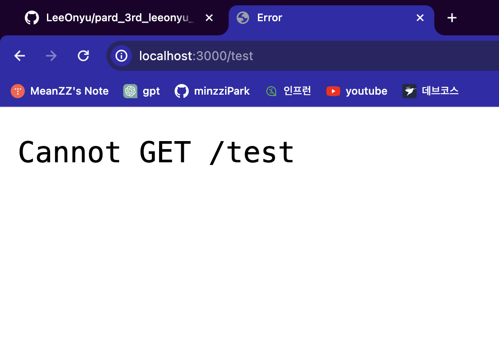
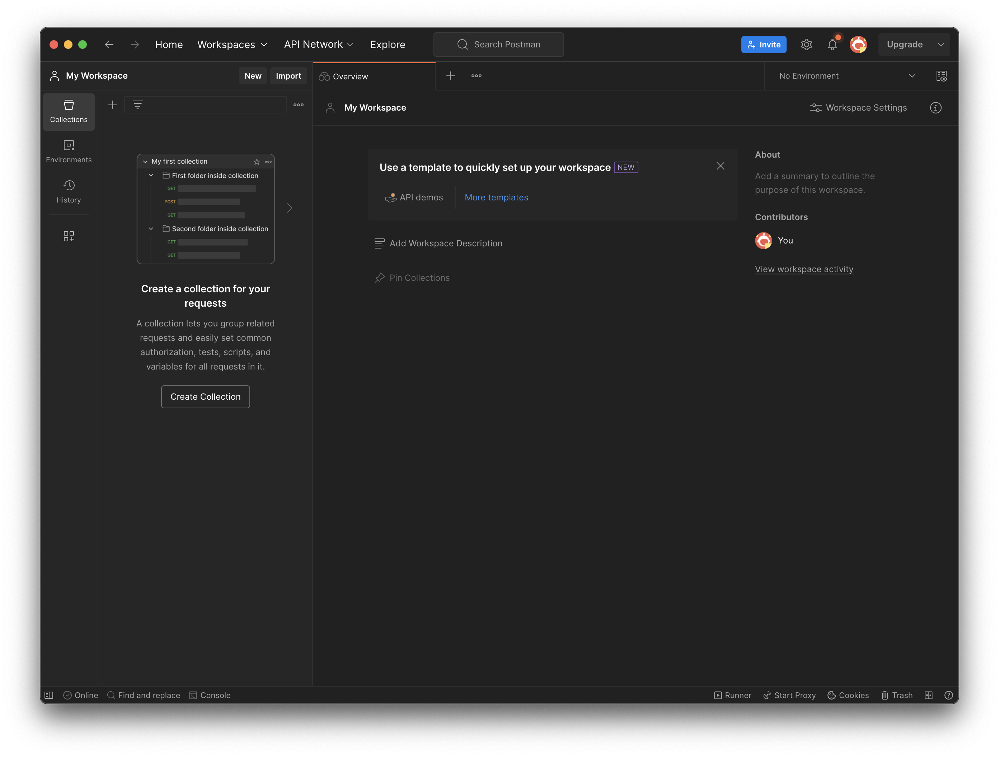
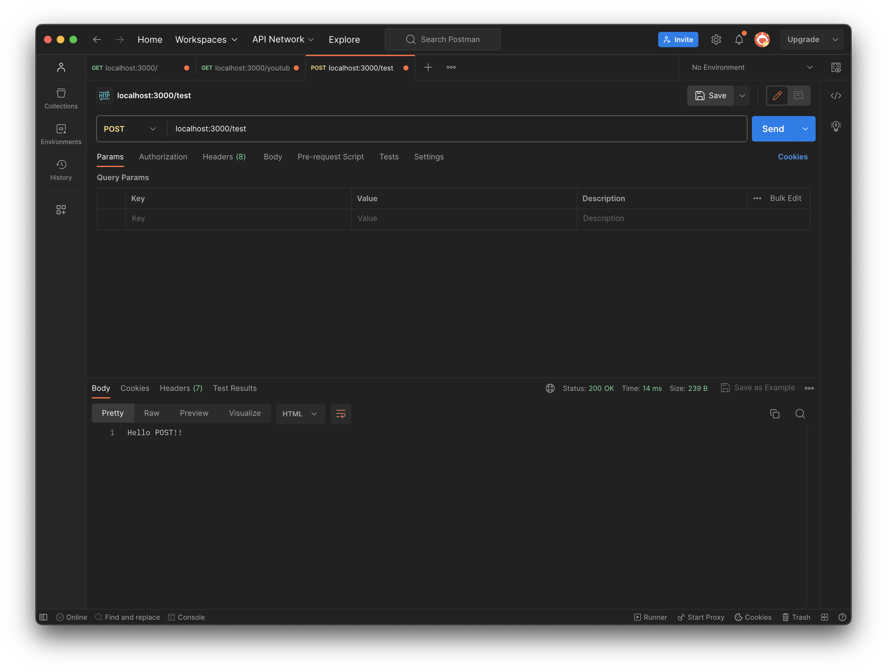
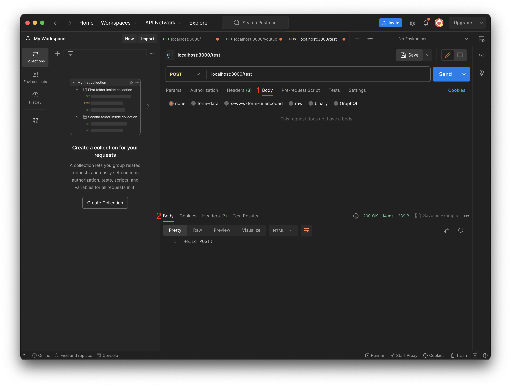
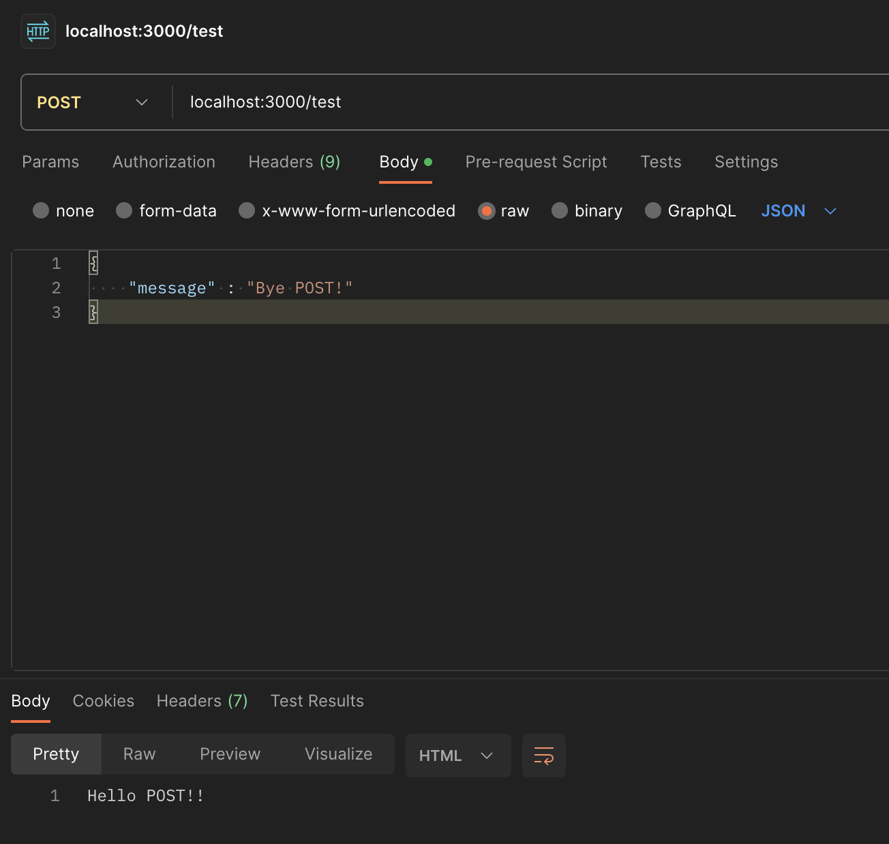

# post 실행를 실행해보자

```
// app.js
app.post("/test", (req, res) => {
  res.send("Hello POST!!");
});
```

### 결과


실행이 잘안되는 것을 볼 수 있음.
<br>

### 왜 안될까?

1. 데이터를 Post하기 위해선 등록하고 싶은 데이터를 보내주어야 한다.
2. URL로 보내면 안되는 이유 -> 보안을 위해
   - 데이터는 숨겨서 보내야 함
   - Body에 숨겨서 보낼 것임

- 어떻게 Body에 있는 내용을 보낼 수 있을까? **postman!!**
  

# postman에서 get 테스트하기

1. 왼쪽 상단 + 버튼 누르기 -> 탭이 뜰 것임
2. method GET으로 맞춰주고 url에 localhost 주소와 path 넣어주기
3. 하단 Body 결과에 res.json 혹은 res.send의 결과가 뜰 것이다.
   

# post를 위해 Body에 데이터 전달하기



- 1번 Body : req로 보낼 body
- 2번 Body : res로 받은 body

## 중요!! app.use(express.json())

-> 위 코드를 넣어주어야만 req로 날아오는 body값을 json 형태로 읽을 수 있다.

사진에 있는대로 request 보낼 때 Body에 raw, JSON으로 선택한 다음 값을 JSON 형식으로 보내주기

### request로 온 body 읽기 req.body

```
app.use(express.json());

app.post("/test", (req, res) => {
  console.log(req.body);
  res.send("Hello POST!!");
});
```
